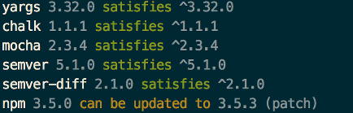

# dep-rep

Dependency reporter for npm

## Get started

### CLI usage

    npm i -g dep-rep
    
From then on, you can run `dep-rep` in any folder containing a `package.json`.

Output will look like this:



### Node usage

    npm i -D dep-rep    

```javascript
const depRep = require('dep-rep');

depRep.analyze("path/to/package.json", outputToConsole)
```

The path can be either relative to the cwd, or an absolute path. By default (pass null), it takes the `package.json` from the cwd.

`outputToConsole` will print the report to console (like the CLI), default is false.

## TODO

- add bower support
- create a UI for the reporter (seperate project)
- add dependency management

## Contribute

### Run CI

    npm run ci
    
### Generate coverage
  
    npm run coverage
