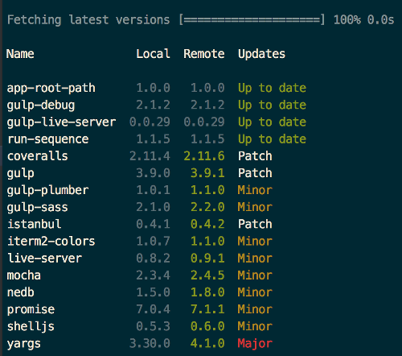

# dep-rep

Dependency reporter for npm

## Get started

### CLI usage

    npm i -g dep-rep    
    
From then on, you can run `dep-rep` in any folder containing a `package.json`.

### Program parameters

Parameters:

```
  -p        path to package.json e.g. -p="../package.json". 
            Can be relative, absolute or an https url. 
            Defaults to the package.json from the working dir.
  --silent  be quiet, or not (default CLI = false, default as node module = true)
  -v        prints out the version of dep-rep (only for CLI)
```

-p can even be a remote (https) url, e.g. 

```bash
dep-rep -p="https://raw.githubusercontent.com/kevin-smets/dep-rep/master/package.json"
```

### Output example

Output will look like this:



Or, if everything is fine:


### Node usage

    npm i -D dep-rep    

```javascript
const depRep = require('dep-rep');

depRep.analyze(options)
  .then(function(result){
    console.log(result);
  })
  .catch(function(err){
    console.log("Ruh Roh: " + err);
  })
```

`options` is an object that takes the same properties as the CLI parameters (except for version). E.g. options.silent = true.

The returned result is not a contract set in stone yet (this module is still in prerelease status).

## TODO

- add bower support
- create a UI for the reporter (seperate project)
- add dependency management

## Contribute

### Run CI

    npm run ci
    
### Generate coverage
  
    npm run coverage
